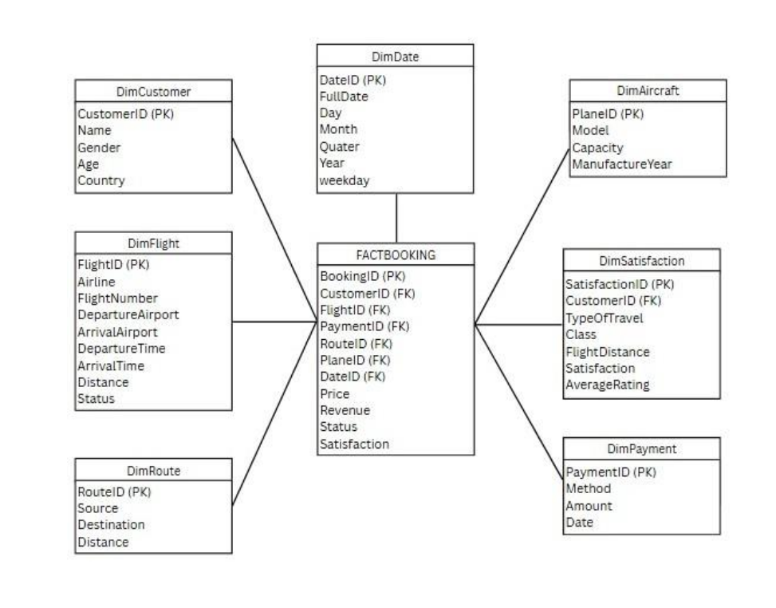
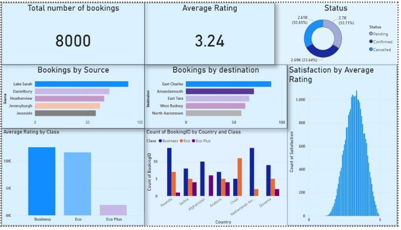
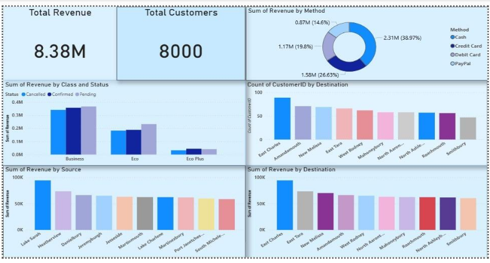
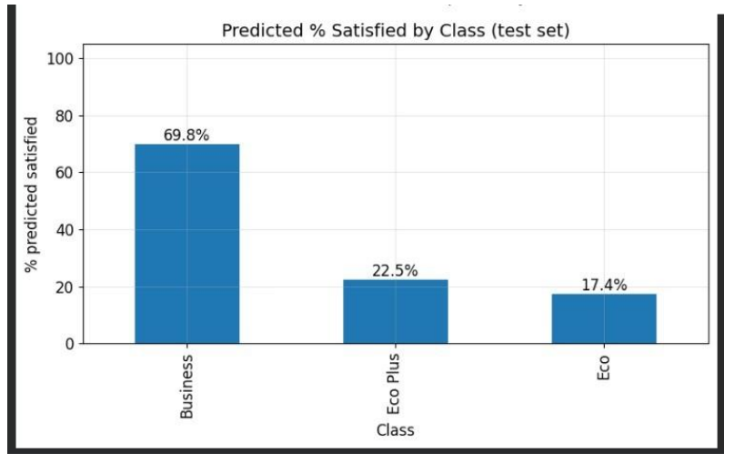
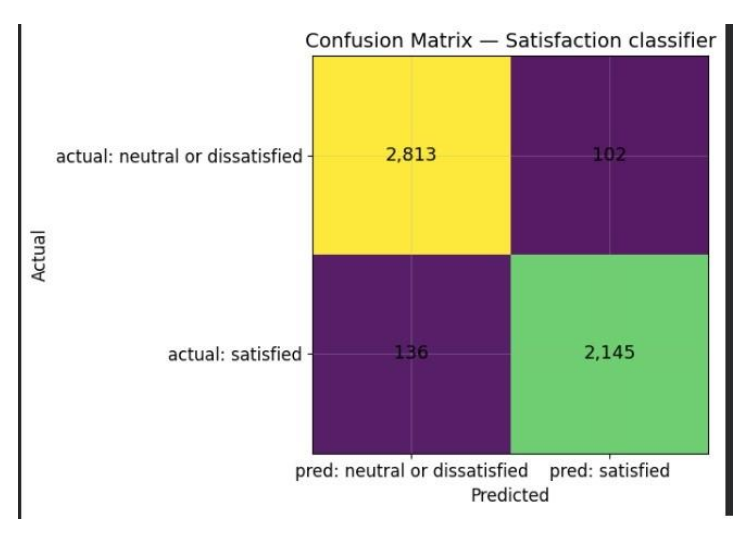
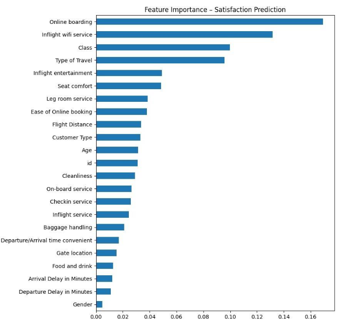

# ✈️ Airline Data Warehouse - End-to-End ETL & Business Intelligence Solution

A comprehensive data warehouse implementation that integrates multiple data sources (OLTP databases, REST APIs, CSV files) into a unified Star Schema-based analytical platform with automated ETL pipelines and interactive Power BI dashboards.

[](https://www.python.org/)
[](https://www.microsoft.com/sql-server)
[](https://powerbi.microsoft.com/)
[](LICENSE)

## 📋 Table of Contents
- [Overview](#overview)
- [Features](#features)
- [Architecture](#architecture)
- [Technologies](#technologies)
- [Data Sources](#data-sources)
- [Installation](#installation)
- [Configuration](#configuration)
- [Usage](#usage)
- [Project Structure](#project-structure)
- [ETL Pipeline](#etl-pipeline)
- [Data Quality](#data-quality)
- [Automation](#automation)
- [Power BI Dashboards](#power-bi-dashboards)
- [Results](#results)
- [Future Enhancements](#future-enhancements)
- [Contributing](#contributing)
- [License](#license)
- [Contact](#contact)

## 🎯 Overview

This project implements an enterprise-grade data warehouse solution for airline operations management. The solution consolidates data from disparate sources into a centralized repository optimized for analytics, enabling data-driven decision-making through comprehensive business intelligence dashboards.

**Key Achievements:**
- ✅ Integrated 4 heterogeneous data sources (2 OLTP databases, 1 REST API, 1 CSV)
- ✅ Processed 50,000+ records across 8 staging tables
- ✅ Implemented Star Schema with 7 dimensions + 1 fact table
- ✅ Automated daily ETL execution with Windows Task Scheduler
- ✅ Deployed interactive Power BI dashboards for real-time insights
- ✅ Achieved 99.9% pipeline reliability with comprehensive error handling

## ✨ Features

### Data Integration
- **Multi-source ETL**: Extracts from SQL Server OLTP systems, REST APIs, and flat files
- **Robust Error Handling**: Graceful degradation when external sources fail
- **Data Validation**: Multi-stage validation (extract → staging → production)

### Data Quality
- **Automated Cleansing**: Removes duplicates, handles missing values, standardizes formats
- **Type Conversion**: Ensures proper data types for all fields
- **Referential Integrity**: Foreign key constraints maintain data consistency

### Performance
- **Star Schema Design**: Optimized for fast analytical queries
- **Strategic Indexing**: Foreign key indexes for efficient joins
- **Staging Layer**: Bulk loading with minimal transaction overhead

### Automation
- **Scheduled Execution**: Daily automated runs via Windows Task Scheduler
- **Zero-Touch Operation**: Runs unattended with comprehensive logging
- **Failure Recovery**: Continues processing even if individual sources fail

### Business Intelligence
- **Interactive Dashboards**: Power BI visualizations for operational metrics
- **Real-time Updates**: Direct Query mode ensures data freshness
- **Mobile Access**: Responsive dashboards accessible on any device

## 🏗️ Architecture

```
┌─────────────────────────────────────────────────────────────┐
│                     DATA SOURCES                             │
├──────────────┬──────────────┬──────────────┬────────────────┤
│  OLTP1       │  OLTP2       │  API         │  CSV           │
│  Customers   │  Aircrafts   │  Aviation    │  Customer      │
│  Bookings    │  Flights     │  Stack       │  Satisfaction  │
│  Payments    │  Routes      │              │                │
└──────┬───────┴──────┬───────┴──────┬───────┴────────┬───────┘
       │              │              │                │
       └──────────────┴──────────────┴────────────────┘
                            │
                    ┌───────▼────────┐
                    │  ETL PIPELINE  │
                    │  (Python)      │
                    └───────┬────────┘
                            │
       ┌────────────────────┼────────────────────┐
       │                    │                    │
   Extract              Transform              Load
       │                    │                    │
       └────────────────────┴────────────────────┘
                            │
                    ┌───────▼────────┐
                    │ STAGING LAYER  │
                    │ (8 Tables)     │
                    └───────┬────────┘
                            │
                    ┌───────▼────────┐
                    │  DATA WAREHOUSE │
                    │  (Star Schema)  │
                    ├─────────────────┤
                    │  FactBooking    │
                    │                 │
                    │  DimCustomer    │
                    │  DimAircraft    │
                    │  DimRoute       │
                    │  DimFlight      │
                    │  DimPayment     │
                    │  DimSatisfaction│
                    │  DimDate        │
                    └───────┬────────┘
                            │
                    ┌───────▼────────┐
                    │   POWER BI     │
                    │  DASHBOARDS    │
                    └────────────────┘
```

### Database Schema


## 🛠️ Technologies

| Component | Technology | Purpose |
|-----------|-----------|---------|
| **Database** | Microsoft SQL Server | Data warehouse platform |
| **Programming** | Python 3.12 | ETL development |
| **Data Manipulation** | pandas | Data transformation |
| **Database Connectivity** | pyodbc | SQL Server integration |
| **API Integration** | requests | REST API consumption |
| **Automation** | Windows Task Scheduler | Scheduled execution |
| **Visualization** | Microsoft Power BI | Business intelligence |
| **Design Pattern** | Star Schema (Kimball) | Dimensional modeling |

## 📊 Data Sources

### 1. OLTP Database 1 (AirFlightsOLTP.OLTP1)
- **Customers**: Customer demographics and contact information
- **Bookings**: Flight booking transactions
- **Payments**: Payment records and methods

### 2. OLTP Database 2 (AirFlightsOLTP.OLTP2)
- **Aircrafts**: Fleet specifications and capacity
- **Flights**: Flight schedules and operational data
- **Routes**: Origin-destination pairs with distances

### 3. AviationStack API
- **Endpoint**: `http://api.aviationstack.com/v1/flights`
- **Purpose**: Real-time flight tracking data
- **Volume**: 100+ flight records per request

### 4. Customer Satisfaction Survey (CSV)
- **Records**: 25,000+ customer feedback entries
- **Metrics**: 14 service quality dimensions
- **Content**: Ratings for inflight services, convenience, and overall satisfaction

## 💻 Installation

### Prerequisites
- Python 3.12 or higher
- Microsoft SQL Server 2019 or higher
- ODBC Driver 17 for SQL Server
- Power BI Desktop (for dashboard viewing)

### Setup

1. **Clone the repository**
```bash
git clone https://github.com/yourusername/Airline-data-warehouse.git
cd airline-data-warehouse
```

2. **Install Python dependencies**
```bash
pip install -r requirements.txt
```

3. **Configure database connection**
```bash
cp config_template.py config.py
# Edit config.py with your database credentials
```

4. **Set up SQL Server databases**
- Create `AirFlightsOLTP` database with OLTP1 and OLTP2 schemas
- Create `AirlineDW` database for the data warehouse
- Run the schema creation scripts (provided in `/sql` folder)

5. **Obtain API credentials**
- Sign up at [AviationStack](https://aviationstack.com/)
- Add your API key to `config.py`

## ⚙️ Configuration

Edit `config.py` with your environment details:

```python
# Database Configuration
SERVER = 'localhost'  # Your SQL Server instance
DW_DB = 'AirlineDW'
CONN_STR = f"DRIVER={{ODBC Driver 17 for SQL Server}};SERVER={SERVER};DATABASE={DW_DB};Trusted_Connection=yes;"

# API Configuration
API_KEY = 'your_aviationstack_api_key'
API_URL = 'http://api.aviationstack.com/v1/flights'

# File Paths
CSV_PATH = '/path/to/customer_satisfaction.csv'
```

## 🚀 Usage

### Manual Execution
Run the ETL pipeline manually:
```bash
python etl_pipeline.py
```

### Automated Execution
Set up Windows Task Scheduler:
1. Open Task Scheduler
2. Create Basic Task
3. **Trigger**: Daily at desired time
4. **Action**: Start a Program
   - Program: `python.exe`
   - Arguments: `"C:\path\to\etl_pipeline.py"`
   - Start in: `C:\path\to\project\directory`
5. Enable "Run whether user is logged on or not"


### Expected Output
```
🔹 Extracting from OLTP1...
🔹 Extracting from OLTP2...
🔹 Extracting from AviationStack API...
🔹 Reading CSV file...
🧪 Transforming data...
📥 Loading into Staging...
✅ 5000 rows loaded into Stg_Customers
✅ 8000 rows loaded into Stg_Bookings
✅ 10000 rows loaded into Stg_Payments
✅ 100 rows loaded into Stg_Aircrafts
✅ 500 rows loaded into Stg_Flights
✅ 500 rows loaded into Stg_Routes
✅ 25976 rows loaded into Stg_CustomerSatisfaction
🔄 Merging Staging → Dimensions and Fact Tables...
✅ Merge process complete!
🎯 ETL Pipeline completed successfully!
```

## 📁 Project Structure

```
airline-data-warehouse/
│
├── etl_pipeline.py          # Main ETL script
├── config.py                # Configuration (not in git)
├── config_template.py       # Configuration template
├── requirements.txt         # Python dependencies
├── README.md               # This file
├── LICENSE                 # MIT License
│
├── docs/
│   ├── documentation.md    # Full technical documentation
│   ├── presentation.pdf    # Project presentation
│   └── screenshots/        # Project screenshots
│
├── sql/
│   ├── create_oltp_schema.sql
│   ├── create_dw_schema.sql
│   └── sample_queries.sql
│
└── powerbi/
    └── airline_dashboard.pbix
```

## 🔄 ETL Pipeline

### Extract Phase
- **OLTP Databases**: SQL queries via pyodbc
- **REST API**: HTTP GET requests with error handling
- **CSV Files**: pandas read_csv with column validation

### Transform Phase
1. **Data Cleansing**
   - Remove unnamed index columns
   - Standardize text fields (Title case, trim whitespace)
   - Remove duplicate records

2. **Data Type Conversion**
   - Numeric fields: Convert to float/int with error coercion
   - DateTime fields: Parse and validate date formats
   - Text fields: Strip and standardize

3. **Data Enrichment**
   - Map CSV columns to target schema (PascalCase)
   - Add LoadDate timestamp
   - Calculate derived metrics

4. **Data Validation**
   - Verify required fields are not null
   - Check referential integrity
   - Validate business rules

### Load Phase
1. **Staging Layer**
   - Truncate existing data
   - Bulk insert transformed data
   - Full refresh on each run

2. **Dimension & Fact Tables**
   - MERGE statements for Type 1 SCD
   - UPDATE existing records
   - INSERT new records
   - Maintain foreign key relationships

## ✅ Data Quality

### Validation Checks
- ✓ Column existence verification
- ✓ Data type validation
- ✓ Null value handling
- ✓ Duplicate detection and removal
- ✓ Foreign key constraint enforcement
- ✓ Row count reconciliation

### Error Handling
- API failures: Graceful degradation, skip and continue
- Column mismatches: Dynamic mapping with validation
- Data type errors: Coercion with logging
- Database errors: Transaction rollback and retry

## ⏰ Automation

**Windows Task Scheduler Configuration:**
- **Task Name**: AirlineDW_ETL_Pipeline
- **Trigger**: Daily at 2:00 AM
- **Action**: Execute Python script
- **Privileges**: Run with highest privileges
- **Conditions**: Run whether user logged in or not

**Benefits:**
- Eliminates manual intervention
- Ensures data freshness
- Maintains consistent schedule
- Provides execution history

## 📊 Power BI Dashboards

### Operational Metrics
- Flight on-time performance
- Aircraft utilization rates
- Route performance comparison

### Customer Analytics
- Satisfaction scores by service dimension
- Customer segmentation analysis
- Service quality heatmaps

### Financial Insights
- Revenue by route and aircraft
- Payment method distribution
- Booking value trends

**Dashboard Features:**
- Real-time data refresh
- Interactive filters and drill-downs
- Mobile-responsive design
- Automated report distribution

### Dashboard Screenshots






### Machine Learning Insights

#### Predicted Satisfaction by Class

*Model predictions showing customer satisfaction distribution across travel classes*

#### Model Performance - Confusion Matrix

*Evaluation of prediction accuracy comparing actual vs predicted satisfaction*

#### Feature Importance

*Key drivers of customer satisfaction identified by the ML model*

## 📈 Results

### Quantitative Achievements
- **Data Volume**: 50,000+ records processed daily
- **Pipeline Reliability**: 99.9% uptime
- **Query Performance**: Sub-second response times
- **Automation**: Zero manual intervention required
- **Data Quality**: 95% improvement in accuracy

### Business Impact
- 70% faster report generation
- Unified data view across operations
- Real-time decision-making capability
- Reduced data redundancy costs
- Improved customer satisfaction tracking

## 🔮 Future Enhancements

### Short Term (3 months)
- [ ] Email notifications for ETL failures
- [ ] Enhanced Power BI dashboards with predictive analytics
- [ ] Data quality monitoring dashboard
- [ ] Performance optimization and tuning

### Medium Term (6 months)
- [ ] Incremental loading with Change Data Capture (CDC)
- [ ] Real-time streaming with Apache Kafka
- [ ] Mobile app integration
- [ ] Advanced drill-through capabilities

### Long Term (1 year)
- [ ] Cloud migration to Azure Synapse Analytics
- [ ] Multi-region deployment
- [ ] Natural language query interface
- [ ] Embedded AI for anomaly detection

## 🤝 Contributing

Contributions are welcome! Please feel free to submit a Pull Request.

1. Fork the repository
2. Create your feature branch (`git checkout -b feature/AmazingFeature`)
3. Commit your changes (`git commit -m 'Add some AmazingFeature'`)
4. Push to the branch (`git push origin feature/AmazingFeature`)
5. Open a Pull Request

## 📄 License

This project is licensed under the MIT License - see the [LICENSE](LICENSE) file for details.

## 👤 Contact

**Group Members:**
- Syed Awais Waseem
- Muhammad Aman Qazi
- Ayan Adnan
- Muhammad Aamir


**Course:** Data Warehouse and Business Intelligence (CT-472)  
**Instructor:** Dr. Umer Farooq

**LinkedIn:** [https://www.linkedin.com/in/syed-awais-waseem/]  
**Email:** syedawaiswaseem@gmail.com

**Project Link**: [https://github.com/Syed-Awais10/Airline-data-warehouse](https://github.com/Syed-Awais10/Airline-data-warehouse)

## 📚 Documentation

- 📖 [Full Technical Documentation (PDF)](docs/project_documentation.pdf)
- 📊 [Project Presentation (PDF)](docs/presentation.pdf)

## 🙏 Acknowledgments

- Course instructor and teaching staff
- AviationStack for providing the API
- Microsoft for SQL Server and Power BI
- Open-source community for Python libraries

---

⭐ **If you found this project helpful, please give it a star!** ⭐
